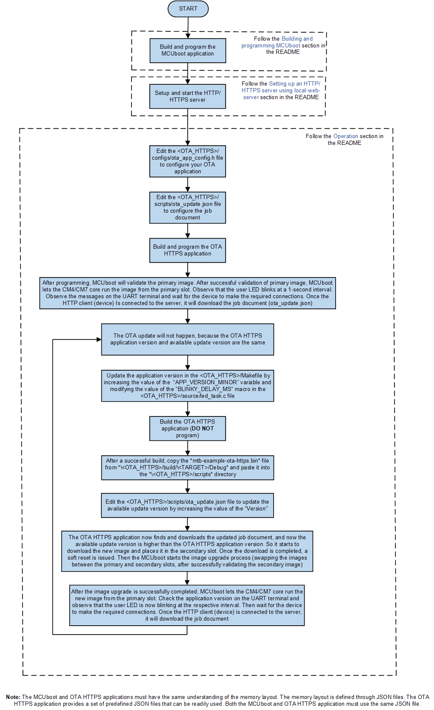
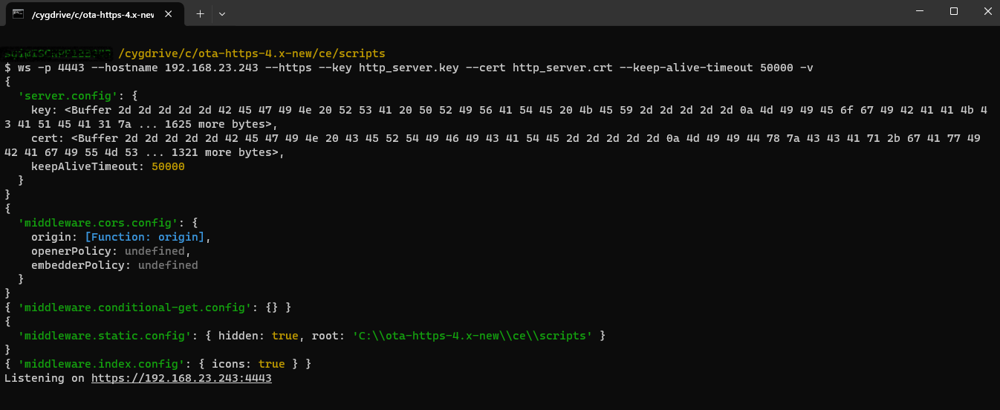
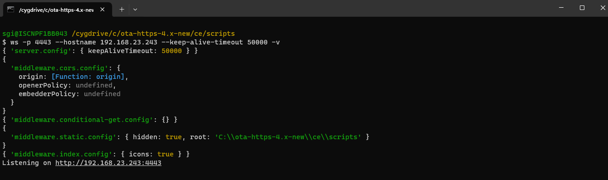
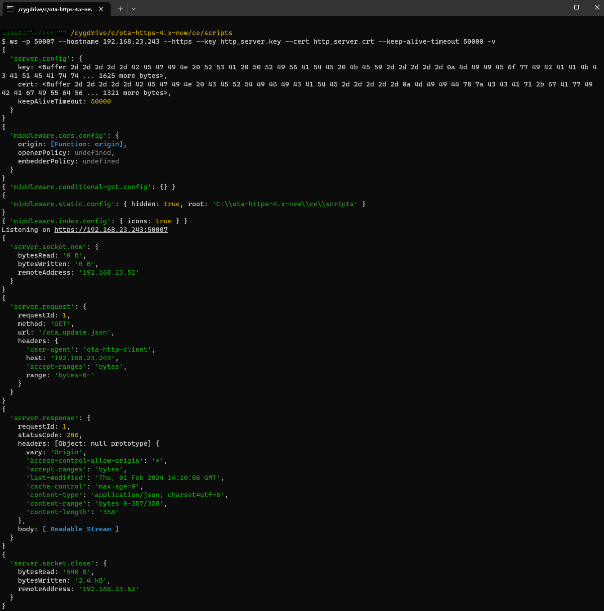
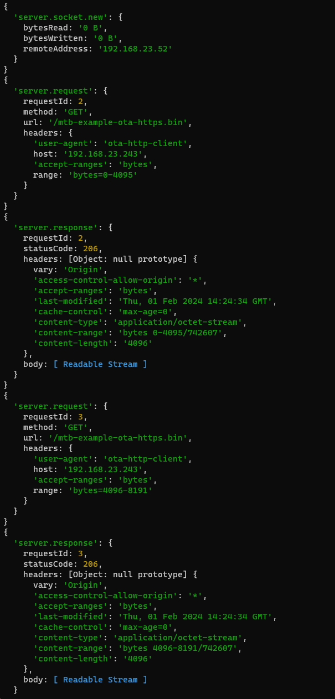
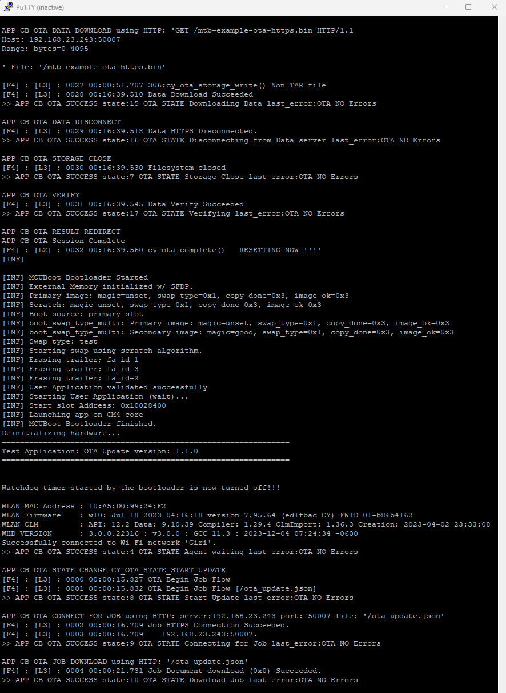
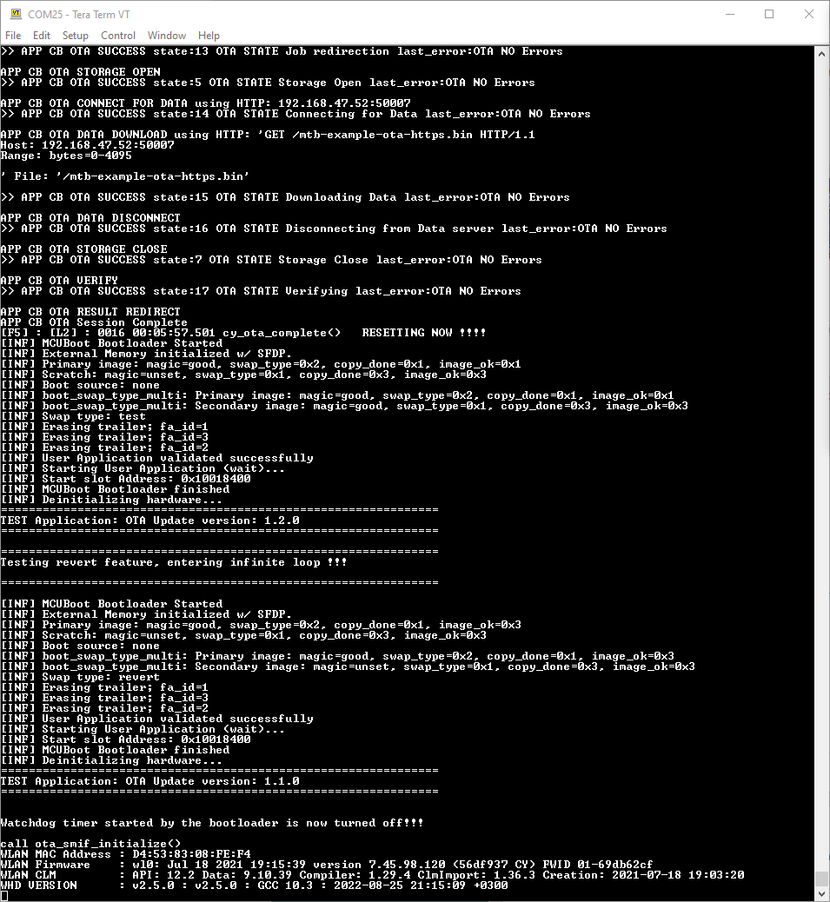

# Over-the-air firmware update using HTTPS

This code example demonstrates an over-the-air (OTA) update with PSoC&trade; 6 or XMC7000 MCU and AIROC&trade; CYW43xxx Wi-Fi & Bluetooth&reg; combo chips. The device establishes a connection with the designated HTTPS server (this example uses local HTTPS server). It periodically checks the job document to see if a new update is available. When a new update is available, it is downloaded and written to the secondary slot (flash). On the next reboot, MCUboot handles image authentication and upgrades.

The upgrade can be either overwrite-based or swap-based. In an overwrite-based upgrade, the new image from the secondary slot is copied to the primary slot after successful validation without the option to revert the upgrade if the new image is inoperable. In a swap-based upgrade, images in the primary and secondary slots are swapped, with the option to revert the upgrade if the new image cannot be validated.

MCUboot is a "secure" bootloader for 32-bit MCUs. For more details, see the [README](https://github.com/Infineon/mtb-example-mcuboot-basic/blob/master/README.md) of the [mtb-example-mcuboot-basic](https://github.com/Infineon/mtb-example-mcuboot-basic) code example.

The over-the-air update middleware library enables the OTA feature. For more details, see the [ota-update](https://github.com/Infineon/ota-update) middleware repository on GitHub.

The ota-update middleware can function independently and work with any bootloader, as long as the required OTA update handling storage APIs are implemented and registered with OTA agent by the user. This example enables the MCUboot support with the help of ota-bootloader-abstraction middleware. For more details, see [README](https://github.com/Infineon/ota-bootloader-abstraction/blob/master/README.md) of the [ota-bootloader-abstraction](https://github.com/Infineon/ota-bootloader-abstraction) middleware.

Build the MCUboot-based bootloader application outside of the OTA HTTPS application. It is programmed separately to the device before flashing the OTA HTTPS application and is not updated for the life of the device.

[View this README on GitHub.](https://github.com/Infineon/mtb-example-ota-https)

[Provide feedback on this code example.](https://cypress.co1.qualtrics.com/jfe/form/SV_1NTns53sK2yiljn?Q_EED=eyJVbmlxdWUgRG9jIElkIjoiQ0UyMzE1ODUiLCJTcGVjIE51bWJlciI6IjAwMi0zMTU4NSIsIkRvYyBUaXRsZSI6Ik92ZXItdGhlLWFpciBmaXJtd2FyZSB1cGRhdGUgdXNpbmcgSFRUUFMiLCJyaWQiOiJ2YWlyIiwiRG9jIHZlcnNpb24iOiI2LjEuMCIsIkRvYyBMYW5ndWFnZSI6IkVuZ2xpc2giLCJEb2MgRGl2aXNpb24iOiJNQ0QiLCJEb2MgQlUiOiJJQ1ciLCJEb2MgRmFtaWx5IjoiUFNPQyJ9)

## Requirements

- [ModusToolbox&trade;](https://www.infineon.com/modustoolbox) v3.1 or later (tested with v3.2)
- Board support package (BSP) minimum required version: 4.0.0
- Programming language: C
- Other tools: Python v3.8.10 or later
- Associated parts: All [PSoC&trade; 6 MCU](https://www.infineon.com/cms/en/product/microcontroller/32-bit-psoc-arm-cortex-microcontroller/psoc-6-32-bit-arm-cortex-m4-mcu/) parts with SDIO interface, [XMC7000 MCU](https://www.infineon.com/cms/en/product/microcontroller/32-bit-industrial-microcontroller-based-on-arm-cortex-m/32-bit-xmc7000-industrial-microcontroller-arm-cortex-m7/), [AIROC&trade; CYW43012 Wi-Fi & Bluetooth&reg; combo chip](https://www.infineon.com/cms/en/product/wireless-connectivity/airoc-wi-fi-plus-bluetooth-combos/wi-fi-4-802.11n/cyw43012), [AIROC&trade; CYW4343W Wi-Fi & Bluetooth&reg; combo chip](https://www.infineon.com/cms/en/product/wireless-connectivity/airoc-wi-fi-plus-bluetooth-combos/wi-fi-4-802.11n/cyw4343w), [AIROC&trade; CYW4373 Wi-Fi & Bluetooth&reg; combo chip](https://www.infineon.com/cms/en/product/wireless-connectivity/airoc-wi-fi-plus-bluetooth-combos/wi-fi-5-802.11ac/cyw4373), [AIROC&trade; CYW43439 Wi-Fi & Bluetooth&reg; combo chip](https://www.infineon.com/cms/en/product/wireless-connectivity/airoc-wi-fi-plus-bluetooth-combos/wi-fi-4-802.11n/cyw43439)

## Supported toolchains (make variable 'TOOLCHAIN')

- GNU Arm&reg; Embedded Compiler v11.3.1 (`GCC_ARM`) – Default value of `TOOLCHAIN`
- Arm&reg; Compiler v6.16 (`ARM`)
- IAR C/C++ Compiler v9.30.1 (`IAR`)

## Supported kits (make variable 'TARGET')

- [PSoC&trade; 62S2 Wi-Fi Bluetooth&reg; Prototyping Kit](https://www.infineon.com/CY8CPROTO-062S2-43439) (`CY8CPROTO-062S2-43439`) – Default value of `TARGET`
- [PSoC&trade; 6 Wi-Fi Bluetooth&reg; Prototyping Kit](https://www.infineon.com/CY8CPROTO-062-4343W) (`CY8CPROTO-062-4343W`)
- [PSoC&trade; 62S2 Wi-Fi Bluetooth&reg; Pioneer Kit](https://www.infineon.com/CY8CKIT-062S2-43012) (`CY8CKIT-062S2-43012`)
- [PSoC&trade; 62S2 Evaluation Kit](https://www.infineon.com/CY8CEVAL-062S2) (`CY8CEVAL-062S2-LAI-4373M2`, `CY8CEVAL-062S2-LAI-43439M2`,`CY8CEVAL-062S2-MUR-43439M2`,  `CY8CEVAL-062S2-MUR-4373EM2`, `CY8CEVAL-062S2-MUR-4373M2`, `CY8CEVAL-062S2-CYW43022CUB`)
- [PSoC&trade; 62S3 Wi-Fi Bluetooth&reg; Prototyping Kit](https://www.infineon.com/CY8CPROTO-062S3-4343W) (`CY8CPROTO-062S3-4343W`)
- [XMC7200 Evaluation Kit](https://www.infineon.com/KIT_XMC72_EVK) (`KIT_XMC72_EVK_MUR_43439M2`)

## Hardware setup

This example uses the board's default configuration. See the kit user guide to ensure that the board is configured correctly.

## Software setup

See the [ModusToolbox&trade; tools package installation guide](https://www.infineon.com/ModusToolboxInstallguide) for information about installing and configuring the tools package.

1. Install a terminal emulator if you don't have one. Instructions in this document use [Tera Term](https://teratermproject.github.io/index-en.html).

2. This example uses a local-web-server to set up a local HTTP server. For more details, see [Setting up an HTTP/HTTPS server using local-web-server](#setting-up-an-httphttps-server-using-local-web-server-based-on-nodejs).

3. Install the Python interpreter and add it to the top of the system path in environmental variables. This code example is tested with [Python v3.8.10](https://www.python.org/downloads/release/python-3810/).

> **Note:** This code example currently does not work with the custom BSP name for the KIT_XMC72_EVK_MUR_43439M2 and CY8CPROTO-062S3-4343W kits. If you want to change the BSP name to a non-default value, ensure to update the custom BSP name in *Makefile* under the relevant section. The build fails, if you do not update the custom BSP name.

## Structure and overview

This code example is a dual-core application, where the MCUboot-based bootloader application runs on the CM0+ core and the OTA HTTPS application runs on the CM4/CM7 core. The OTA HTTPS application fetches the new image and places it in the secondary slot (flash), then the MCUboot ensures updating the existing image with the new image. The [mtb-example-mcuboot-basic](https://github.com/Infineon/mtb-example-mcuboot-basic) code example is the MCUboot-based bootloader application used for this purpose.

Build and program the MCUboot-based bootloader application and this OTA HTTPS application independently. Place them separately in the workspace as you would do for any other two independent applications. For this example, require only the MCUboot-based bootloader application. The root directory of the MCUboot-based bootloader application is referred to as *\<MCUboot>/<bootloader_app>* and the root directory of the OTA HTTPS application is referred to as *\<OTA_HTTPS>* in this document. An example workspace is as follows:

   ```
   <example-workspace>
      |
      |-<MCUboot>               # MCUboot-based bootloader and blinky applications directory
      |-<OTA_HTTPS>             # OTA HTTPS application directory
      |-<mtb_shared>            # Shared library for both the applications
      |
   ```
Build and program the MCUboot-based bootloader application into the CM0+ core, and this must be done only once. The OTA HTTPS application can then be programmed into the CM4/CM7 core and you need to only modify this application for all application purposes.

This README expects you to be familiar with MCUboot and its concepts. See [MCUboot basics](https://github.com/Infineon/mtb-example-mcuboot-basic/blob/master/README.md#mcuboot-basics) and MCUboot repository on [GitHub](https://github.com/mcu-tools/mcuboot/tree/v1.9.1-cypress/boot/cypress) for more information.

## Using the code example

### Create the project

The ModusToolbox&trade; tools package provides the Project Creator as both a GUI tool and a command line tool.

<details><summary><b>Use Project Creator GUI</b></summary>

1. Open the Project Creator GUI tool.

   There are several ways to do this, including launching it from the dashboard or from inside the Eclipse IDE. For more details, see the [Project Creator user guide](https://www.infineon.com/ModusToolboxProjectCreator) (locally available at *{ModusToolbox&trade; install directory}/tools_{version}/project-creator/docs/project-creator.pdf*).

2. On the **Choose Board Support Package (BSP)** page, select a kit supported by this code example. See [Supported kits](#supported-kits-make-variable-target).

   > **Note:** To use this code example for a kit not listed here, you may need to update the source files. If the kit does not have the required resources, the application may not work.

3. On the **Select Application** page:

   a. Select the **Applications(s) Root Path** and the **Target IDE**.

   > **Note:** Depending on how you open the Project Creator tool, these fields may be pre-selected for you.

   b. Select this code example from the list by enabling its check box.

   > **Note:** You can narrow the list of displayed examples by typing in the filter box.

   c. (Optional) Change the suggested **New Application Name** and **New BSP Name**.

   d. Click **Create** to complete the application creation process.

</details>

<details><summary><b>Use Project Creator CLI</b></summary>

The 'project-creator-cli' tool can be used to create applications from a CLI terminal or from within batch files or shell scripts. This tool is available in the *{ModusToolbox&trade; install directory}/tools_{version}/project-creator/* directory.

Use a CLI terminal to invoke the 'project-creator-cli' tool. On Windows, use the command-line 'modus-shell' program provided in the ModusToolbox&trade; installation instead of a standard Windows command-line application. This shell provides access to all ModusToolbox&trade; tools. You can access it by typing "modus-shell" in the search box in the Windows menu. In Linux and macOS, you can use any terminal application.

The following example clones the "[mtb-example-ota-https](https://github.com/Infineon/mtb-example-ota-https)" application with the desired name "OTA_HTTPS" configured for the *CY8CPROTO-062S2-43439* BSP into the specified working directory, *C:/mtb_projects*:

   ```
   project-creator-cli --board-id CY8CPROTO-062S2-43439 --app-id mtb-example-ota-https --user-app-name OTA_HTTPS --target-dir "C:/mtb_projects"
   ```

The 'project-creator-cli' tool has the following arguments:

Argument | Description | Required/optional
---------|-------------|-----------
`--board-id` | Defined in the <id> field of the [BSP](https://github.com/Infineon?q=bsp-manifest&type=&language=&sort=) manifest | Required
`--app-id`   | Defined in the <id> field of the [CE](https://github.com/Infineon?q=ce-manifest&type=&language=&sort=) manifest | Required
`--target-dir`| Specify the directory in which the application is to be created if you prefer not to use the default current working directory | Optional
`--user-app-name`| Specify the name of the application if you prefer to have a name other than the example's default name | Optional

<br>

> **Note:** The project-creator-cli tool uses the `git clone` and `make getlibs` commands to fetch the repository and import the required libraries. For details, see the "Project creator tools" section of the [ModusToolbox&trade; tools package user guide](https://www.infineon.com/ModusToolboxUserGuide) (locally available at {ModusToolbox&trade; install directory}/docs_{version}/mtb_user_guide.pdf).

</details>

### Open the project

After the project has been created, you can open it in your preferred development environment.

<details><summary><b>Eclipse IDE</b></summary>

If you opened the Project Creator tool from the included Eclipse IDE, the project will open in Eclipse automatically.

For more details, see the [Eclipse IDE for ModusToolbox&trade; user guide](https://www.infineon.com/MTBEclipseIDEUserGuide) (locally available at *{ModusToolbox&trade; install directory}/docs_{version}/mt_ide_user_guide.pdf*).

</details>

<details><summary><b>Visual Studio (VS) Code</b></summary>

Launch VS Code manually, and then open the generated *{project-name}.code-workspace* file located in the project directory.

For more details, see the [Visual Studio Code for ModusToolbox&trade; user guide](https://www.infineon.com/MTBVSCodeUserGuide) (locally available at *{ModusToolbox&trade; install directory}/docs_{version}/mt_vscode_user_guide.pdf*).

</details>

<details><summary><b>Keil µVision</b></summary>

Double-click the generated *{project-name}.cprj* file to launch the Keil µVision IDE.

For more details, see the [Keil µVision for ModusToolbox&trade; user guide](https://www.infineon.com/MTBuVisionUserGuide) (locally available at *{ModusToolbox&trade; install directory}/docs_{version}/mt_uvision_user_guide.pdf*).

</details>

<details><summary><b>IAR Embedded Workbench</b></summary>

Open IAR Embedded Workbench manually, and create a new project. Then select the generated *{project-name}.ipcf* file located in the project directory.

For more details, see the [IAR Embedded Workbench for ModusToolbox&trade; user guide](https://www.infineon.com/MTBIARUserGuide) (locally available at *{ModusToolbox&trade; install directory}/docs_{version}/mt_iar_user_guide.pdf*).

</details>

<details><summary><b>Command line</b></summary>

If you prefer to use the CLI, open the appropriate terminal, and navigate to the project directory. On Windows, use the command-line 'modus-shell' program; on Linux and macOS, you can use any terminal application. From there, you can run various `make` commands.

For more details, see the [ModusToolbox&trade; tools package user guide](https://www.infineon.com/ModusToolboxUserGuide) (locally available at *{ModusToolbox&trade; install directory}/docs_{version}/mtb_user_guide.pdf*).

</details>

## Testing flow of OTA HTTPS application
To test the flow of an OTA HTTPS application, follow the flow chart as shown in **Figure 1**.

   **Figure 1. Testing flow of OTA HTTPS application**

   

## Building and programming MCUboot

The [mtb-example-mcuboot-basic](https://github.com/Infineon/mtb-example-mcuboot-basic) code example bundles two applications:

- MCUboot-based bootloader application that runs on CM0+ core
- Blinky application that runs on CM4/CM7 core

1. Import the [mtb-example-mcuboot-basic](https://github.com/Infineon/mtb-example-mcuboot-basic) code example per the instructions in the [Using the code example](https://github.com/Infineon/mtb-example-mcuboot-basic/blob/master/README.md#using-the-code-example) section of its README.

   The MCUboot-based bootloader and OTA HTTPS applications must have the same understanding of the memory layout. The memory layout is defined through JSON files. The OTA HTTPS application provides a set of predefined JSON files that can be readily used.
   > **Note:** Both the MCUboot-based bootloader and OTA HTTPS applications must use the same JSON file.

   The *\<OTA_HTTPS>/flashmap* folder contains the pre-defined *flashmap* JSON files. The following files are supported by this example.

   **Table 1. Supported JSON files**

   Target      | Supported JSON files
   ----------- |----------------------------------
   CY8CPROTO-062S2-43439 <br> CY8CPROTO-062-4343W <br> CY8CKIT-062S2-43012 <br> CY8CEVAL-062S2-LAI-4373M2 <br> CY8CEVAL-062S2-LAI-43439M2 <br> CY8CEVAL-062S2-MUR-43439M2 <br> CY8CEVAL-062S2-MUR-4373EM2 <br> CY8CEVAL-062S2-MUR-4373M2 <br> CY8CEVAL-062S2-CYW43022CUB | psoc62_2m_ext_overwrite_single.json <br> psoc62_2m_ext_swap_single.json
   CY8CPROTO-062S3-4343W | psoc62_512k_xip_swap_single.json
   KIT_XMC72_EVK_MUR_43439M2 | xmc7200_int_overwrite_single.json <br> xmc7200_int_swap_single.json

   <br>

2. Copy the required *flashmap* JSON file from the *\<OTA_HTTPS>/flashmap* folder and paste it in the *\<MCUboot>/flashmap* folder.

3. Modify the value of the `FLASH_MAP` variable in the *\<MCUboot>/user_config.mk* file to the selected JSON file name from the previous step.

4. Connect the board to your PC using the provided USB cable through the KitProg3 USB connector.

5. Open a CLI terminal.

   On Linux and macOS, you can use any terminal application. On Windows, from the Start menu, open the **modus-shell** app.

6. Navigate the terminal to the *\<mtb_shared>/mcuboot/\<tag>/scripts* folder.

7. Run the following commands to ensure that the required modules are installed.

    > **Note:** For Linux and macOS platforms, use `python3` instead of `python` in the following command:

      ```
      python -m pip install -r requirements.txt
      ```
      ```
      python -m pip install --upgrade cysecuretools==5.0.0
      ```

    > **Note:** *cysecuretools* is used for signing the image for XMC7000 MCUs.

8. Open a serial terminal emulator and select the KitProg3 COM port. Set the serial port parameters to 8N1 and 115200 baud.

9. Build and program the bootloader application per the [Step-by-step instructions](https://github.com/Infineon/mtb-example-mcuboot-basic/blob/master/README.md#step-by-step-instructions) in its README or follow the instruction as given below.

   <details open><summary><b>Using CLI</b></summary>

     From the terminal, go to *\<MCUboot>/bootloader_app* and execute the `make program_proj` command to build and program the MCUboot-based bootloader application using the default toolchain to the selected target.

      ```
      make program_proj
      ```
   </details>

    After programming, MCUboot starts automatically. Confirm that the UART terminal displays a message as shown in **Figure 2**:

    **Figure 2. Booting with no bootable image**

    


## Setting up an HTTP/HTTPS server using local-web-server (based on *node.js*)

This code example uses a local server to demonstrate the OTA operation over HTTP/HTTPS. In this example, [local-web-server](https://www.npmjs.com/package/local-web-server) is used. It is a lean and modular web server for rapid full-stack development.

1. Download and install [node.js](https://nodejs.org/en/download/).
   Install with the default settings. **Do not tick** the checkbox to install the optional tools for native modules.

2. Open a CLI terminal.

   On Linux and macOS, you can use any terminal application. On Windows, from the Start menu, open the *modus-shell* app.

3. Navigate to the *\<OTA_HTTPS>/scripts/* folder.

4. Execute the following command to generate self-signed SSL certificates and keys. On Linux and macOS, you can get your device-local IP address by running the `ifconfig` command on any terminal application. On Windows, run the `ipconfig` command on a command prompt.

   ```
   sh generate_ssl_cert.sh <local-ip-address-of-your-pc>
   ```

   Example:
   ```
   sh generate_ssl_cert.sh 192.168.0.10
   ```

   This step will generate the following files in the same *\<OTA_HTTPS>/scripts/* directory:

   - *http_ca.crt* – Root CA certificate
   - *http_ca.key* – Root CA private key
   - *http_server.crt* – Server certificate
   - *http_server.key* – Server private key
   - *http_client.crt* – Client certificate
   - *http_client.key* – Client private key

5. Execute the following command to install [local-web-server](https://www.npmjs.com/package/local-web-server).

   ```
   npm install -g local-web-server
   ```

6. Start the local HTTP/HTTPS server:

   **Using the code example in TLS mode (default)**, execute the following command:

      ```
      ws -p 443 --hostname <local-ip-address-of-your-pc> --https --key http_server.key --cert http_server.crt --keep-alive-timeout <milli-seconds> -v
      ```

      Example:
      ```
      ws -p 443 --hostname 192.168.0.10 --https --key http_server.key --cert http_server.crt --keep-alive-timeout 50000 -v
      ```
   **Figure 3. HTTPS server started in TLS mode**

   


    **Using the code example in non-TLS mode**, execute the following command:

      ```
      ws -p 8080 --hostname <local-ip-address-of-your-pc> --keep-alive-timeout <milli-seconds> -v
      ```

      Example:
      ```
      ws -p 8080 --hostname 192.168.0.10 --keep-alive-timeout 50000 -v
      ```

   **Figure 4. HTTPS server started in non-TLS mode**

   

> **Note:** If you are running a local-web-server server on a device which is maintained by your organization or institution, the firewall settings may not permit you to host a file server on the local network. To verify whether the file server has been hosted properly from a device connected to the same local network, check the server link on a browser. Browse for `http://<ip-address-noted-earlier>:<port-number-noted-earlier>`; for example: `http://192.168.0.10:8080`. If the files in the *\<OTA_HTTPS>/scripts/* directory are listed on the browser page, you have a properly working file server. Do not proceed to the next section without getting the file server to work.

## Operation

1. Connect the board to your PC using the provided USB cable through the KitProg3 USB connector.

2. Open a terminal program and select the KitProg3 COM port. Set the serial port parameters to 8N1 and 115200 baud.

3. Modify the `PLATFORM` variable in the *\<OTA_HTTPS>/Makefile* based on the target you have selected. Currently in the Makefile, a conditional if-else block is used to automatically select a value based on the target selected. You can remove it and directly assign a value as per **Table 2**.

   **Table 2: Target-specific platform values**

   Target      | `PLATFORM` value
   ----------- |----------------------------------
   CY8CPROTO-062S2-43439 <br> CY8CPROTO-062-4343W <br> CY8CKIT-062S2-43012 <br> CY8CEVAL-062S2-LAI-4373M2 <br> CY8CEVAL-062S2-LAI-43439M2 <br> CY8CEVAL-062S2-MUR-43439M2 <br> CY8CEVAL-062S2-MUR-4373EM2 <br> CY8CEVAL-062S2-MUR-4373M2 <br> CY8CEVAL-062S2-CYW43022CUB | PSOC_062_2M
   CY8CPROTO-062S3-4343W | PSOC_062_512K
   KIT_XMC72_EVK_MUR_43439M2 | XMC7200

   <br>

4. Modify the `OTA_FLASH_MAP` variable in the *\<OTA_HTTPS>/Makefile* to change the JSON file name to match the selection made while programming the MCUboot-based bootloader application. Currently in the Makefile, a conditional `if-else` block is used to automatically select a default flash map file based on the target selected. You can remove it and directly assign the path of the required flash map file to the `OTA_FLASH_MAP` variable.

   The *\<OTA_HTTPS>/flashmap* folder contains the pre-defined flashmap JSON files. The following files are supported by this example.

   **Table 3: Supported JSON files**

   Target      | Supported JSON files
   ----------- |----------------------------------
   CY8CPROTO-062S2-43439 <br> CY8CPROTO-062-4343W <br> CY8CKIT-062S2-43012 <br> CY8CEVAL-062S2-LAI-4373M2 <br> CY8CEVAL-062S2-LAI-43439M2 <br> CY8CEVAL-062S2-MUR-43439M2 <br> CY8CEVAL-062S2-MUR-4373EM2 <br> CY8CEVAL-062S2-MUR-4373M2 <br> CY8CEVAL-062S2-CYW43022CUB | psoc62_2m_ext_overwrite_single.json <br> psoc62_2m_ext_swap_single.json
   CY8CPROTO-062S3-4343W | psoc62_512k_xip_swap_single.json
   KIT_XMC72_EVK_MUR_43439M2 | xmc7200_int_overwrite_single.json <br> xmc7200_int_swap_single.json

   <br>

   > **Note:** Both the MCUboot-based bootloader and the OTA HTTPS application must use the same JSON file.

5. Edit the *\<OTA_HTTPS>/configs/ota_app_config.h* file to configure your OTA HTTPS application:

   1. Modify the connection configuration such as `WIFI_SSID`, `WIFI_PASSWORD`, and `WIFI_SECURITY` macros to match the settings of your Wi-Fi network. Ensure that the device running the HTTP server and the kit are connected to the same network.

   2. Modify the `HTTP_SERVER` address to match the IP address of your HTTP server.

   3. Ensure that the value of the `HTTP_SERVER_PORT` macro is `443`.

      > **Note:** If the code example has been configured to work in non-TLS mode, set the value of `HTTP_SERVER_PORT` macro as `8080`.

   4. By default, this code example uses HTTPS (TLS) protocol. To use the example in HTTP (non-TLS) mode, modify `ENABLE_TLS` to **false** and skip the next step of adding the certificate.

   5. Add the certificates and key:

      1. Open a CLI terminal.

          On Linux and macOS, you can use any terminal application. On Windows, from the Start menu, open **modus-shell** app.

      2. Navigate the terminal to *\<OTA_HTTPS>/scripts/* directory.

      3. Run the *format_cert_key.py* Python script to generate the string format of the *http_ca.crt* file that can be added as a macro. Pass the name of the certificate with the extension as an argument to the Python script:

         > **Note:** For Linux and macOS platforms, use `python3` instead of `python` in the following command.

         ```
         python format_cert_key.py <one-or-more-file-name-of-certificate-or-key-with-extension>
         ```

         Example:
         ```
         python format_cert_key.py http_ca.crt
         ```
      4. Copy the generated string and add it to the `ROOT_CA_CERTIFICATE` macro as per the sample shown.

         > **Note:** The local-web-server does not authenticate a client through the certificate; this is the reason why the client certificate and client key are not added here. If you use some other server, which can do client-side authentication, add the *http_client.crt* and *http_client.key* files. Also, set the `USING_CLIENT_CERTIFICATE` and `USING_CLIENT_KEY` macros to value **true**.

6. Edit the job document (*\<OTA_HTTPS>/scripts/ota_update.json*):

   1. Modify the value of the variable `Board` to your selected `TARGET` in the following format.

      ```
      if TARGET=APP_CY8CPROTO-062S2-43439, then Board:"APP_CY8CPROTO_062S2_43439"

      if TARGET=APP_KIT_XMC72_EVK_MUR_43439M2, then Board:"APP_KIT_XMC72_EVK_MUR_43439M2"
      ```
      Example:
      ```
      "Board":"APP_CY8CPROTO_062S2_43439",
      ```
      > **Note:** Please make sure to change the `-` to `_` in the `Board` variable value while copying from the `TARGET` variable.

   2. Modify the value of the `Server` to match the IP address of your HTTP server.

   3. Ensure that the value of the `Port` is `443`.

      > **Note:** If the code example has been configured to work in non-TLS mode, set the value of `Port` as `8080`.

   4. Ensure that the value of the `Connection` is `HTTPS`.

      > **Note:** If the code example has been configured to work in non-TLS mode, set the value of `Connection` as `HTTP`.

7. Program the board using one of the following:

   <details><summary><b>Using Eclipse IDE</b></summary>

      1. Select the application project in the Project Explorer.

      2. In the **Quick Panel**, scroll down, and click **\<Application Name> Program (KitProg3_MiniProg4)**.
   </details>

   <details><summary><b>In other IDEs</b></summary>

   Follow the instructions in your preferred IDE.
   </details>

   <details><summary><b>Using CLI</b></summary>

     From the terminal, execute the `make program` command to build and program the application using the default toolchain to the default target. The default toolchain is specified in the application's Makefile but you can override this value manually:
      ```
      make program TOOLCHAIN=<toolchain>
      ```

      Example:
      ```
      make program TOOLCHAIN=GCC_ARM
      ```
   </details>

8. After programming, MCUboot will validate the primary image. After successfully validating the primary image, MCUboot let the CM4/CM7 core run the image from the primary slot. Observe that the user LED blinks at a one second interval. Observe the messages on the UART terminal and wait for the device to make the required connections. Once the HTTP client (device) is connected to the server, it will download the job document (*ota_update.json*) as shown in **Figure 6**.

   **Figure 5** shows the logs of HTTP server response for the job document request from the HTTP client.

   **Figure 5. Response for the job document request**

   

   **Figure 6. Connection to the HTTP server**

   

9. The job document (*ota_update.json*) placed in the *\<OTA_HTTPS>/scripts* folder has value of `Version` as **1.0.0**. The OTA update will not happen because the OTA HTTPS application version and available update version are the same.

10. Modify the value of the `BLINKY_DELAY_MS` macro to **(100)** in the *\<OTA_HTTPS>/source/led_task.c* file and change the application version in the *\<OTA_HTTPS>/Makefile* by setting `APP_VERSION_MINOR` to **1**.

11. Build the application (**Do not** program it to the kit). This new image will be uploaded to the HTTP server in the following steps to demonstrate the OTA update.

   <details><summary><b>In Eclipse IDE</b></summary>

      1. Select the application project in the Project Explorer.

      2. In the **Quick Panel**, scroll down, and click **Build \<Application Name> Application**.
    </details>

    <details><summary><b>Using CLI</b></summary>

      1. From the terminal, execute the `make build` command to build the application using the default toolchain to the default target. You can specify a toolchain manually:
         ```
         make build TOOLCHAIN=<toolchain>
         ```
         Example:
         ```
         make build TOOLCHAIN=GCC_ARM
         ```
 </details>

11. After a successful build, copy the *mtb-example-ota-https.bin* file from *\<OTA_HTTPS>/build/\<TARGET>/Debug* and paste it to the *\<OTA_HTTPS>/scripts* directory.

12. Edit the *\<OTA_HTTPS>/scripts/ota_update.json* file to modify the value of `Version` to **1.1.0**.

   The OTA HTTPS application finds and downloads the updated job document resulting in the available update version which is higher than the OTA HTTPS application version. So, the OTA HTTPS application starts to download the new image as shown in **Figure 8** and places it in the secondary slot. Once the download is completed, a soft reset is issued. Then the MCUboot starts the image upgrade process (swapping the images between the primary and secondary slots after successfully validating the secondary image). This takes approximately 15 to 20 minutes.

   **Figure 7** shows the logs of HTTP server while uploading the new image.

   **Figure 7. Uploading the new image**

   

   **Figure 8. Image download**

   

   After the image upgrade is completed successfully, MCUboot lets the CM7 core run the new image from the primary slot. Observe that the user LED is now blinking at a 100-millisecond interval and The UART terminal displays the message as shown in **Figure 9**.

   **Figure 9. Updated to new image**

   

To test the revert feature of MCUboot, send a bad image as **v1.2.0** OTA update. The bad image used in this example is an infinite loop. The watchdog timer will reset the bad image and upon reboot, MCUboot will revert the primary image back to **v1.1.0**, the good image.

13. Edit *\<OTA_HTTPS>/Makefile* and add `TEST_REVERT` to the `Defines` variable as shown:

      ```
      DEFINES+=TEST_REVERT
      ```


    > **Note:** In an overwrite-based upgrade, the secondary image is simply copied to the primary slot after successful validation. There is no way to revert the upgrade if the secondary image is inoperable. `TEST_REVERT` feature is not applicable for overwrite-based upgrade.

    See the [MCUboot basics](https://github.com/Infineon/mtb-example-mcuboot-basic/blob/master/README.md#mcuboot-basics) of the [mtb-example-mcuboot-basic](https://github.com/Infineon/mtb-example-mcuboot-basic) code example for more details about the overwrite-based and swap-based upgrades.

14. Edit the application version in the *\<OTA_HTTPS>/Makefile* by setting `APP_VERSION_MINOR` to **2**.

15. Build the application as per **Step 10**.

16. After a successful build, copy the *mtb-example-ota-https.bin* file from *\<OTA_HTTPS>/build/\<TARGET>/Debug* and paste it into the *\<OTA_HTTPS>/scripts* directory.

17. Edit the *\<OTA_HTTPS>/scripts/ota_update.json* file to modify the value of `Version` to **1.2.0**.

18. The OTA HTTPS application will now find this new **v1.2.0** image and update to it. After the update, the watchdog timer resets the devices within a few seconds. Upon reset, MCUboot reverts to the **v1.1.0** good image. The UART terminal displays the message as shown in **Figure 10**.

    **Figure 10. Reverting to good image**

    

      > **Note:** After the last step is complete, the device will be running the **v1.1.0** good image and the server will still have the **v1.2.0** bad image. Because the version of the image on the server is greater than the version of the image on the device, the device will re-download the **v1.2.0** bad image. This causes an infinite upgrade and reverts the cycle. To avoid this scenario, stop the HTTP/HTTPS server after you test the code example. In a production environment, the application is responsible for blacklisting bad image versions and to avoid upgrading to them in the future.

## Debugging

You can debug the example to step through the code.


<details><summary><b>In Eclipse IDE</b></summary>

Use the **\<Application Name> Debug (KitProg3_MiniProg4)** configuration in the **Quick Panel**. For details, see the "Program and debug" section in the [Eclipse IDE for ModusToolbox&trade; user guide](https://www.infineon.com/MTBEclipseIDEUserGuide).

</details>


<details><summary><b>In other IDEs</b></summary>

Follow the instructions in your preferred IDE.
</details>


## Design and implementation

**Figure 11** shows the flow of the OTA update process using HTTPS. The application which needs OTA updates should run the OTA agent. The OTA agent spawns threads to receive OTA updates when available, without intervening with the application's core functionality.

The initial application resides in the primary slot of the flash. When the OTA agent receives an update, the new image is placed in the secondary slot of the flash. On the next reboot, MCUboot copies the image from the secondary slot into the primary slot, and then CM4 or CM7 will run the upgraded image from the primary slot.

**Figure 11. Overview of OTA update using HTTPS**


For more details on the features and configurations offered by the [ota-update](https://github.com/Infineon/ota-update) library, see its [README](https://github.com/Infineon/ota-update/blob/master/README.md).

Both MCUboot-based bootloader and user applications must have an identical understanding of the memory layout. Otherwise, the MCUboot may consider an authentic image as invalid.

For more details on the features and configurations of MCUboot-based bootloader, see the [Design and implementation of MCUboot](https://github.com/Infineon/mtb-example-mcuboot-basic/blob/master/README.md#design-and-implementation).

This example implements two RTOS tasks: OTA client and LED blinky. Both these tasks are independent and do not communicate with each other. The OTA client task initializes the dependent middleware and starts the OTA agent. The LED task blinks the user LED at a specified delay.

All the source files related to the two tasks are placed under the *\<OTA_HTTPS>/source* folder:

**Table 4: Source files related to OTA client and LED blinky**

File | Description
:-----|:------
*ota_task.c*| Contains the task and functions related to the OTA client
*ota_task.h* | Contains the public interfaces for the OTA client task
*led_task.c* | Contains the task and functions related to LED blinking
*led_task.h* | Contains the public interfaces for the LED blink task
*main.c* | Initializes the BSP and the retarget-io library, and creates the OTA client and LED blink tasks
*heap_usage* | Contains the code for printing heap usage

<br>

All the scripts and configurations needed for this example are placed under the *\<OTA_HTTPS>/scripts* folder:

**Table 5: Scripts and configuration files for OTA update over HTTPS**

File | Description
:-----|:------
*generate_ssl_cert.sh*| Shell script to generate the required self-signed CA, server, and client certificates
*ota_update.json* | OTA job document
*format_cert_key.py* | Python script to convert certificate/key to string format
<br>

The *\<OTA_HTTPS>/configs* folder contains other configurations related to the OTA middleware, FreeRTOS, and MBEDTLS.

**Table 6: Application configuration files**

File | Description
:-----|:------
*ota_app_config.h* | Contains the OTA and Wi-Fi configuration macros such as SSID, password, HTTP server details, certificates, and key.
*cy_ota_config.h* | Contains the OTA middleware level configuration macros.
*mbedtls_user_config.h* | Contains the mbedtls configuration macros.
*COMPONENT_CM7/FreeRTOSConfig.h* | Contains the FreeRTOS configuration macros for XMC7000 family.
*COMPONENT_CM4/FreeRTOSConfig.h* | Contains the FreeRTOS configuration macros for PSoC&trade; 6 family.
*COMPONENT_MCUBOOT/flash/cy_ota_flash.c* | Contains OTA flash operation APIs.
*COMPONENT_MCUBOOT/flash/COMPONENT_OTA_PSOC_062/flash_qspi.c* | Contains QSPI flash related APIs.
*COMPONENT_MCUBOOT/flash/COMPONENT_OTA_PSOC_062/flash_qspi.h* | Contains the declaration of QSPI flash related APIs.
<br>

### Security

The MCUboot-based bootloader application enables the image authentication feature of the MCUboot library. MCUboot verifies the signature of the image in the primary slot every time before booting. In addition, it verifies the signature of the image in the secondary slot before copying it to the primary slot. When these options are enabled, the public key (*cypress-test-ec-p256.pub*) is embedded within the MCUboot-based bootloader application. The OTA HTTPS application is signed using the private key (*cypress-test-ec-p256.pem*) during the post-build steps, the ota-bootloader-abstraction library handles the image signing for the OTA HTTPS application.

The MCUboot-based bootloader application includes a sample public key (*cypress-test-ec-p256.pub*) under the *\<MCUboot>/keys* directory and the OTA HTTPS application includes a sample private key (*cypress-test-ec-p256.pem*) under the *\<mtb_shared>/ota-bootloader-abstraction/\<tag>/scripts/mcuboot/keys* directory. Both the *\<MCUboot>/keys* and *\<mtb_shared>/ota-bootloader-abstraction/\<tag>/scripts/mcuboot/keys* directories **must have the same pair of keys**. Otherwise image (primary/secondary) validation fails; the MCUboot-based bootloader application prints a message "MCUBoot Bootloader found none of bootable images".

**Do not use this key pair in your end product.** See [Generating a key pair](https://github.com/Infineon/mtb-example-mcuboot-basic/blob/master/README.md#generating-a-key-pair) for generating a new key pair. Once you generated the key pair, copy the keys to the both *\<MCUboot>/keys* and *\<mtb_shared>/ota-bootloader-abstraction/\<tag>/scripts/mcuboot/keys* directories.

> **Note:** See [Security](https://github.com/Infineon/mtb-example-mcuboot-basic/blob/master/README.md#security) to learn more about the image authentication feature of MCUboot.


### Resources and settings

**Table 7. Application resources**

 Resource  |  Alias/object     |    Purpose
 :-------- | :-------------    | :------------
 UART (HAL)|cy_retarget_io_uart_obj| UART HAL object used by Retarget-IO for the Debug UART port
 GPIO (HAL)    | CYBSP_USER_LED     | User LED

<br>

## Related resources

Resources  | Links
-----------|----------------------------------
Application notes  | [AN228571](https://www.infineon.com/AN228571) – Getting started with PSoC&trade; 6 MCU on ModusToolbox&trade; <br>  [AN215656](https://www.infineon.com/AN215656) – PSoC&trade; 6 MCU: Dual-CPU system design <br> [AN234334](https://www.infineon.com/dgdl/Infineon-AN234334_Getting_started_with_XMC7000_MCU_on_ModusToolbox_software-ApplicationNotes-v01_00-EN.pdf?fileId=8ac78c8c8412f8d301842d32c5765bfd) – Getting started with XMC7000 MCU on ModusToolbox&trade; <br> [AN234023](https://www.infineon.com/dgdl/Infineon-AN234023-Smart_IO_usage_setup_in_XMC7000_family-ApplicationNotes-v01_00-EN.pdf?fileId=8ac78c8c8412f8d301845123d1704f20) – Smart IO usage setup in XMC7000 family 
Code examples  | [Using ModusToolbox&trade;](https://github.com/Infineon/Code-Examples-for-ModusToolbox-Software) on GitHub
Device documentation | [PSoC&trade; 6 MCU datasheets](https://documentation.infineon.com/html/psoc6/bnm1651211483724.html) <br> [PSoC&trade; 6 reference manuals](https://documentation.infineon.com/html/psoc6/zrs1651212645947.html)<br>[XMC7000 MCU datasheets](https://www.infineon.com/cms/en/product/microcontroller/32-bit-industrial-microcontroller-based-on-arm-cortex-m/32-bit-xmc7000-industrial-microcontroller-arm-cortex-m7) <br> [XMC7000 reference manuals](https://www.infineon.com/cms/en/product/microcontroller/32-bit-industrial-microcontroller-based-on-arm-cortex-m/32-bit-xmc7000-industrial-microcontroller-arm-cortex-m7)
Development kits | Select your kits from the [Evaluation board finder](https://www.infineon.com/cms/en/design-support/finder-selection-tools/product-finder/evaluation-board) <br> [XMC&trade; evaluation boards](https://www.infineon.com/cms/en/product/microcontroller/32-bit-industrial-microcontroller-based-on-arm-cortex-m/#boards)
Libraries on GitHub  | [mtb-pdl-cat1](https://github.com/Infineon/mtb-pdl-cat1) – PSoC&trade; 6 Peripheral Driver Library (PDL)  <br> [mtb-hal-cat1](https://github.com/Infineon/mtb-hal-cat1) – Hardware Abstraction Layer (HAL) library
Middleware on GitHub  | [psoc6-middleware](https://github.com/Infineon/modustoolbox-software#psoc-6-middleware-libraries) – Links to all PSoC&trade; 6 MCU middleware<br>[mcu-middleware](https://github.com/Infineon/modustoolbox-software) – Links to all MCU middleware <br> [MCUboot](https://github.com/mcu-tools/mcuboot) – Open-source library enabling the development of secure bootloader applications for 32-bit MCUs <br> [retarget-io](https://github.com/Infineon/retarget-io) – Utility library to retarget STDIO messages to a UART port <br> [ota-update](https://github.com/Infineon/ota-update) – OTA library and docs <br> [wifi-mw-core](https://github.com/Infineon/wifi-mw-core) – Wi-Fi middleware core library and docs <br> [ota-bootloader-abstraction](https://github.com/Infineon/ota-bootloader-abstraction) - OTA MCUboot-based bootloader abstraction <br> [http-client](https://github.com/Infineon/http-client) – HTTP client library and docs
Tools  | [ModusToolbox&trade;](https://www.infineon.com/modustoolbox) – ModusToolbox&trade; software is a collection of easy-to-use libraries and tools enabling rapid development with Infineon MCUs for applications ranging from wireless and cloud-connected systems, edge AI/ML, embedded sense and control, to wired USB connectivity using PSoC&trade; Industrial/IoT MCUs, AIROC&trade; Wi-Fi and Bluetooth&reg; connectivity devices, XMC&trade; Industrial MCUs, and EZ-USB&trade;/EZ-PD&trade; wired connectivity controllers. ModusToolbox&trade; incorporates a comprehensive set of BSPs, HAL, libraries, configuration tools, and provides support for industry-standard IDEs to fast-track your embedded application development.
<br>

## Other resources

Infineon provides a wealth of data at [www.infineon.com](https://www.infineon.com) to help you select the right device, and quickly and effectively integrate it into your design.

For XMC&trade; MCU devices, see [32-bit XMC&trade; Industrial microcontroller based on Arm&reg; Cortex&reg;-M](https://www.infineon.com/cms/en/product/microcontroller/32-bit-industrial-microcontroller-based-on-arm-cortex-m/).


## Document history

Document title: *CE231585* – *Over-the-air firmware update using HTTPS*

 Version | Description of change
 ------- | ---------------------
 1.0.0   | New code example
 1.1.0   | Updated the configuration file to support MbedTLS v2.22.0
 2.0.0   | Update to:<br>1. Support anycloud-ota v4.X library. <br>2. Support swap upgrade with MCUboot. <br>3. Support local-web-server instead of mongoose
 3.0.0   | Update to support ModusToolbox&trade; software v2.4 and BSP v3.X<br> Added support for CY8CEVAL-062S2-MUR-43439M2 and CY8CEVAL-062S2-LAI-4373M2 kits
 4.0.0   | Updated the example to use the new ota-update v1.0.0 library
 5.0.0   | Updated the example to use the ota-update v1.1.0 library <br> Updated to support ModusToolbox&trade; software v3.0<br> Added support for CY8CPROTO-062S3-4343W kit
 5.1.0   | Added support for CY8CEVAL-062S2-LAI-43439M2
 5.2.0   | Added support for CY8CPROTO-062S2-43439
 5.3.0   | Updated to support ModusToolbox&trade; v3.1 and added support for CY8CEVAL-062S2-MUR-4373M2 and CY8CEVAL-062S2-MUR-4373EM2 
 5.4.0   | Added support for CY8CEVAL-062S2-CYW43022CUB
 5.5.0   | Updated to support ModusToolbox&trade; v3.2
 6.0.0   | Updated to support OTA update middleware v4.0.0<br /> Added support for KIT_XMC72_EVK_MUR_43439M2 kit.
 6.1.0   | Updated to support PDL v3.11.0
<br>

All referenced product or service names and trademarks are the property of their respective owners.

The Bluetooth&reg; word mark and logos are registered trademarks owned by Bluetooth SIG, Inc., and any use of such marks by Infineon is under license.

---------------------------------------------------------

© Cypress Semiconductor Corporation, 2020-2024. This document is the property of Cypress Semiconductor Corporation, an Infineon Technologies company, and its affiliates ("Cypress").  This document, including any software or firmware included or referenced in this document ("Software"), is owned by Cypress under the intellectual property laws and treaties of the United States and other countries worldwide.  Cypress reserves all rights under such laws and treaties and does not, except as specifically stated in this paragraph, grant any license under its patents, copyrights, trademarks, or other intellectual property rights.  If the Software is not accompanied by a license agreement and you do not otherwise have a written agreement with Cypress governing the use of the Software, then Cypress hereby grants you a personal, non-exclusive, nontransferable license (without the right to sublicense) (1) under its copyright rights in the Software (a) for Software provided in source code form, to modify and reproduce the Software solely for use with Cypress hardware products, only internally within your organization, and (b) to distribute the Software in binary code form externally to end users (either directly or indirectly through resellers and distributors), solely for use on Cypress hardware product units, and (2) under those claims of Cypress's patents that are infringed by the Software (as provided by Cypress, unmodified) to make, use, distribute, and import the Software solely for use with Cypress hardware products.  Any other use, reproduction, modification, translation, or compilation of the Software is prohibited.
<br>
TO THE EXTENT PERMITTED BY APPLICABLE LAW, CYPRESS MAKES NO WARRANTY OF ANY KIND, EXPRESS OR IMPLIED, WITH REGARD TO THIS DOCUMENT OR ANY SOFTWARE OR ACCOMPANYING HARDWARE, INCLUDING, BUT NOT LIMITED TO, THE IMPLIED WARRANTIES OF MERCHANTABILITY AND FITNESS FOR A PARTICULAR PURPOSE.  No computing device can be absolutely secure.  Therefore, despite security measures implemented in Cypress hardware or software products, Cypress shall have no liability arising out of any security breach, such as unauthorized access to or use of a Cypress product. CYPRESS DOES NOT REPRESENT, WARRANT, OR GUARANTEE THAT CYPRESS PRODUCTS, OR SYSTEMS CREATED USING CYPRESS PRODUCTS, WILL BE FREE FROM CORRUPTION, ATTACK, VIRUSES, INTERFERENCE, HACKING, DATA LOSS OR THEFT, OR OTHER SECURITY INTRUSION (collectively, "Security Breach").  Cypress disclaims any liability relating to any Security Breach, and you shall and hereby do release Cypress from any claim, damage, or other liability arising from any Security Breach.  In addition, the products described in these materials may contain design defects or errors known as errata which may cause the product to deviate from published specifications. To the extent permitted by applicable law, Cypress reserves the right to make changes to this document without further notice. Cypress does not assume any liability arising out of the application or use of any product or circuit described in this document. Any information provided in this document, including any sample design information or programming code, is provided only for reference purposes.  It is the responsibility of the user of this document to properly design, program, and test the functionality and safety of any application made of this information and any resulting product.  "High-Risk Device" means any device or system whose failure could cause personal injury, death, or property damage.  Examples of High-Risk Devices are weapons, nuclear installations, surgical implants, and other medical devices.  "Critical Component" means any component of a High-Risk Device whose failure to perform can be reasonably expected to cause, directly or indirectly, the failure of the High-Risk Device, or to affect its safety or effectiveness.  Cypress is not liable, in whole or in part, and you shall and hereby do release Cypress from any claim, damage, or other liability arising from any use of a Cypress product as a Critical Component in a High-Risk Device. You shall indemnify and hold Cypress, including its affiliates, and its directors, officers, employees, agents, distributors, and assigns harmless from and against all claims, costs, damages, and expenses, arising out of any claim, including claims for product liability, personal injury or death, or property damage arising from any use of a Cypress product as a Critical Component in a High-Risk Device. Cypress products are not intended or authorized for use as a Critical Component in any High-Risk Device except to the limited extent that (i) Cypress's published data sheet for the product explicitly states Cypress has qualified the product for use in a specific High-Risk Device, or (ii) Cypress has given you advance written authorization to use the product as a Critical Component in the specific High-Risk Device and you have signed a separate indemnification agreement.
<br>
Cypress, the Cypress logo, and combinations thereof, ModusToolbox, PSoC, CAPSENSE, EZ-USB, F-RAM, and TRAVEO are trademarks or registered trademarks of Cypress or a subsidiary of Cypress in the United States or in other countries. For a more complete list of Cypress trademarks, visit www.infineon.com. Other names and brands may be claimed as property of their respective owners.

