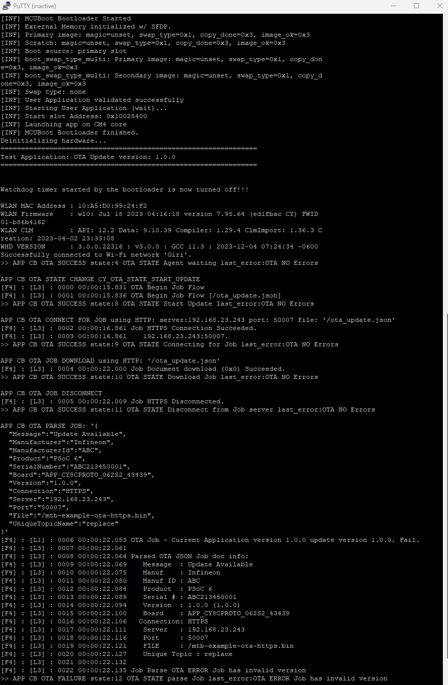
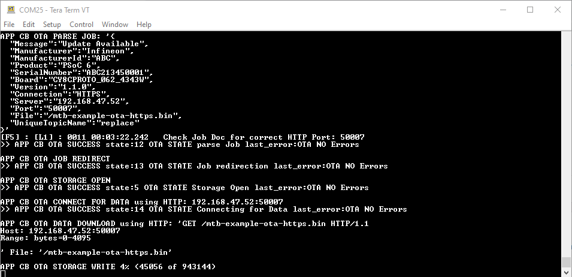

# AnyCloud Example: Over-the-Air Firmware Update Using HTTPS

This code example demonstrates an OTA update with PSoC 6 MCU and CYW43xxx connectivity devices. The device establishes a connection with the designated HTTPS server. It periodically checks the job document to see if a new update is available. When a new update is available, it will be downloaded and written to the secondary slot. On the next reboot, MCUboot will copy the new image over to the primary slot and run the application.

MCUboot is a secure bootloader for 32-bit MCUs. See [README](https://github.com/cypresssemiconductorco/mtb-example-psoc6-mcuboot-basic/blob/master/README.md) of [mtb-example-psoc6-mcuboot-basic](https://github.com/cypresssemiconductorco/mtb-example-psoc6-mcuboot-basic) code example for more details.

The OTA feature is enabled by the *Over-the-Air update middleware library*. See the [anycloud-ota](https://github.com/cypresssemiconductorco/anycloud-ota) middleware repository on GitHub for more details.

[Provide feedback on this Code Example.](https://cypress.co1.qualtrics.com/jfe/form/SV_1NTns53sK2yiljn?Q_EED=eyJVbmlxdWUgRG9jIElkIjoiQ0UyMzE1ODUiLCJTcGVjIE51bWJlciI6IjAwMi0zMTU4NSIsIkRvYyBUaXRsZSI6IkFueUNsb3VkIEV4YW1wbGU6IE92ZXItdGhlLUFpciBGaXJtd2FyZSBVcGRhdGUgVXNpbmcgSFRUUFMiLCJyaWQiOiJ5ZWt0IiwiRG9jIHZlcnNpb24iOiIxLjEuMCIsIkRvYyBMYW5ndWFnZSI6IkVuZ2xpc2giLCJEb2MgRGl2aXNpb24iOiJNQ0QiLCJEb2MgQlUiOiJJQ1ciLCJEb2MgRmFtaWx5IjoiUFNPQyJ9)

## Requirements

- [ModusToolbox® software](https://www.cypress.com/products/modustoolbox-software-environment) v2.2
- Board Support Package (BSP) minimum required version: 2.0.0
- Programming Language: C
- Associated Parts: All [PSoC® 6 MCU](http://www.cypress.com/PSoC6) parts with SDIO interface

## Supported Toolchains (make variable 'TOOLCHAIN')

- GNU Arm® Embedded Compiler v9.3.1 (`GCC_ARM`) - Default value of `TOOLCHAIN`
- IAR C/C++ compiler v8.42.2 (`IAR`)

## Supported Kits (make variable 'TARGET')

This example requires PSoC 6 MCU devices with at least 2 MB flash and 1 MB SRAM, and therefore supports only the following kits:

- [PSoC 6 Wi-Fi BT Prototyping Kit](https://www.cypress.com/CY8CPROTO-062-4343W) (`CY8CPROTO-062-4343W`) - Default value of `TARGET`
- [PSoC 62S2 Wi-Fi BT Pioneer Kit](https://www.cypress.com/CY8CKIT-062S2-43012) (`CY8CKIT-062S2-43012`)

## Hardware Setup

This example uses the board's default configuration. See the kit user guide to ensure that the board is configured correctly.

## Software Setup

Install a terminal emulator if you don't have one. Instructions in this document use [Tera Term](https://ttssh2.osdn.jp/index.html.en).

Install a Python Interpreter if you don't have one and add it to the PATH. This code example is tested using [Python 3.7.7](https://www.python.org/downloads/release/python-377/), but other versions may work.

This examples uses Mongoose to setup a local HTTP server, see section [Setting up HTTP/HTTPS server using Mongoose](#setting-up-httphttps-server-using-mongoose) for more details.

## Code Example Structure and Overview

This code example is a dual-core project, where the MCUboot bootloader app runs on the CM0+ core and the OTA update app runs on the CM4 core. The OTA update app fetches the new image and places it in the flash memory; the bootloader is the one which takes care of updating the existing image with the new image. The [mtb-example-psoc6-mcuboot-basic](https://github.com/cypresssemiconductorco/mtb-example-psoc6-mcuboot-basic) bootloader project is used for this purpose.

The bootloader project and this OTA update project should be built and programmed independently. They must be placed separately in the workspace as you would do for any other two independent projects. An example workspace would look something like this:

   ```
   <example-workspace>
      |
      |-<mtb-example-psoc6-mcuboot-basic>
      |-<mtb-example-psoc6-ota-http>
      |
   ```

You must first build and program the MCUboot bootloader project into the CM0+ core; this need to be done only once. The OTA update app can then be programmed into the CM4 core; you need to only modify this app for all application purposes.

## Building and Programming MCUboot

The [mtb-example-psoc6-mcuboot-basic](https://github.com/cypresssemiconductorco/mtb-example-psoc6-mcuboot-basic) code example bundles two applications. The bootloader app, which runs on CM0+ and the Blinky app, which runs on CM4. For this code example, only the bootloader app is required and the root directory of the bootloader app is referred as *\<bootloader_cm0p>* in this document.

1. Import the code example [mtb-example-psoc6-mcuboot-basic](https://github.com/cypresssemiconductorco/mtb-example-psoc6-mcuboot-basic) per the instructions in the [Using the Code Example](https://github.com/cypresssemiconductorco/mtb-example-psoc6-mcuboot-basic#using-the-code-example) section of its [README](https://github.com/cypresssemiconductorco/mtb-example-psoc6-mcuboot-basic/blob/master/README.md).

2. The Bootloader app and the OTA application must have the same understanding of the memory layout. Override the default memory layout by editing the make variables in the *\<bootloader_cm0p>/shared_config.mk* file. For this example, perform the following edits to match the memory layout with the OTA application:

   ```
   MCUBOOT_SLOT_SIZE=0x1C0000
   MCUBOOT_SCRATCH_SIZE=0x4000
   MCUBOOT_MAX_IMG_SECTORS=3584
   ```

3. Copy the *\<bootloader_cm0p>/libs/mcuboot/boot/cypress/MCUBootApp/config* folder and paste it in the *\<bootloader_cm0p>* folder.

4. Edit the *\<bootloader_cm0p>/config/mcuboot_config/mcuboot_config.h* file and comment out the following defines to skip checking the image signature:

   ```
   #define MCUBOOT_SIGN_EC256
   #define NUM_ECC_BYTES (256 / 8)
   .
   .
   .
   #define MCUBOOT_VALIDATE_PRIMARY_SLOT
   ```

5. Edit *\<bootloader_cm0p>/app.mk* and replace the MCUboot include `$(MCUBOOTAPP_PATH)/config` with `./config`. This will get the build system to find the new copy of the config directory that you pasted in the *\<bootloader_cm0p>* folder, instead of the default one supplied by the library.

6. Edit *\<bootloader_cm0p>/Makefile* and set `USE_EXT_FLASH` to 1, because the OTA application uses the external flash to store the secondary image.

7. Connect the board to your PC using the provided USB cable through the KitProg3 USB connector.

8. Open a command line interface (CLI) terminal. On Linux and macOS, you can use any terminal application. On Windows, open the **modus-shell** app from the Start menu.

9. Navigate the terminal to *<bootloader_cm0p>/libs/mcuboot/scripts* directory.

10. Run the following command to ensure that the required modules are installed or already present ("Requirement already satisfied:" is printed).

      ```
      pip install -r requirements.txt
      ```

11. Open a serial terminal emulator and select the KitProg3 COM port. Set the serial port parameters to 8N1 and 115200 baud.

12. Build and program the application per the [Step-by-Step](https://github.com/cypresssemiconductorco/mtb-example-psoc6-mcuboot-basic#step-by-step-instructions) instructions in its [README](https://github.com/cypresssemiconductorco/mtb-example-psoc6-mcuboot-basic/blob/master/README.md).

13. After programming, the bootloader application starts automatically.

    **Figure 1. Booting with No Bootable Image**

    

**Note:** This example does not demonstrate securely upgrading the image and booting from it using the features such as image-signing and secure boot. See the [PSoC 64 Line of Secure MCUs](https://www.cypress.com/psoc64) that offer all those features built around MCUboot.

## Using the OTA Code Example

### In Eclipse IDE for ModusToolbox:

1. Click the **New Application** link in the **Quick Panel** (or, use **File** > **New** > **ModusToolbox Application**). This launches the [Project Creator](http://www.cypress.com/ModusToolboxProjectCreator) tool.

2. Pick a kit supported by the code example from the list shown in the **Project Creator - Choose Board Support Package (BSP)** dialog.

   When you select a supported kit, the example is reconfigured automatically to work with the kit. To work with a different supported kit later, use the [Library Manager](https://www.cypress.com/ModusToolboxLibraryManager) to choose the BSP for the supported kit. You can use the Library Manager to select or update the BSP and firmware libraries used in this application. To access the Library Manager, click the link from the **Quick Panel**.

   You can also just start the application creation process again and select a different kit.

   If you want to use the application for a kit not listed here, you may need to update the source files. If the kit does not have the required resources, the application may not work.

3. In the **Project Creator - Select Application** dialog, choose the example by enabling the checkbox.

4. Optionally, change the suggested **New Application Name**.

5. Optionally, enter the local path in the **Application(s) Root Path** field to indicate where the application needs to be created.

   Applications that can share libraries can be placed in the same root path.

6. Click **Create** to complete the application creation process.

For more details, see the [Eclipse IDE for ModusToolbox User Guide](https://www.cypress.com/MTBEclipseIDEUserGuide) (locally available at *{ModusToolbox install directory}/ide_{version}/docs/mt_ide_user_guide.pdf*).

### In Command-line Interface (CLI):

ModusToolbox provides the Project Creator as both a GUI tool and a command line tool to easily create one or more ModusToolbox applications. See the "Project Creator Tools" section of the [ModusToolbox User Guide](https://www.cypress.com/ModusToolboxUserGuide) for more details.

Alternatively, you can manually create the application using the following steps:

1. Download and unzip this repository onto your local machine, or clone the repository.

2. Open a CLI terminal and navigate to the application folder.

   On Linux and macOS, you can use any terminal application. On Windows, open the **modus-shell** app from the Start menu.

   **Note:** The cloned application contains a default BSP file (*TARGET_xxx.mtb*) in the *deps* folder. Use the [Library Manager](https://www.cypress.com/ModusToolboxLibraryManager) (`make modlibs` command) to select and download a different BSP file, if required. If the selected kit does not have the required resources or is not [supported](#supported-kits-make-variable-target), the application may not work.

3. Import the required libraries by executing the `make getlibs` command.

Various CLI tools include a `-h` option that prints help information to the terminal screen about that tool. For more details, see the [ModusToolbox User Guide](https://www.cypress.com/ModusToolboxUserGuide) (locally available at *{ModusToolbox install directory}/docs_{version}/mtb_user_guide.pdf*).

### In Third-party IDEs:

1. Follow the instructions from the [CLI](#in-command-line-interface-cli) section to create the application, and import the libraries using the `make getlibs` command.

2. Export the application to a supported IDE using the `make <ide>` command.

    For a list of supported IDEs and more details, see the "Exporting to IDEs" section of the [ModusToolbox User Guide](https://www.cypress.com/ModusToolboxUserGuide) (locally available at *{ModusToolbox install directory}/docs_{version}/mtb_user_guide.pdf*.

3. Follow the instructions displayed in the terminal to create or import the application as an IDE project.

## Setting up HTTP/HTTPS server using Mongoose

This code example uses a local server to demonstrate the OTA operation over HTTP/HTTPS. [Mongoose](https://cesanta.com/mongoose-library.html) is an embedded web server, which is supported on multiple platforms. For Windows, you can download a stand-alone executable, which starts the sever on one click. This example uses [*Mongoose v6.5*](https://www.softpedia.com/get/Internet/Servers/WEB-Servers/Mongoose.shtml); all configurations and instructions are applicable only for this version and may not work for other versions. For the latest version and support, see [https://www.cesanta.com/mongoose-library.html](https://www.cesanta.com/mongoose-library.html).

The root directory of the OTA application is referred to as *\<OTA Application>* in this document.

1. Download the [*Mongoose v6.5*](https://www.softpedia.com/get/Internet/Servers/WEB-Servers/Mongoose.shtml) executable and place it in a empty folder. This directory where the executable is placed will be called *\<Mongoose Directory>* in this document.

2. Run the executable; an HTTP server is created. A firewall pop up may appear asking to allow or deny Mongoose to communicate on the network. Provide access on the private network.

3. A browser will open automatically with the IP address of the server. Check if this IP address is same as the local IP address assigned to your device by the wireless router.

   On Linux and macOS, you can get your device local IP address by running the `ifconfig` command on any terminal application. On Windows, run the `ipconfig` command on a command prompt.

   If you have virtual machines installed on your device, Mongoose might start the server on the IP address of those network adapters. Check the network adapter settings and disable the adapters related to the virtual machines. If the network adapter settings are changed, Mongoose must be closed from the system tray and restarted by running the executable again. Re-check whether the IP address shown in the new browser window is the same as the device's local IP address.

4. Note down the IP address and port number.

5. Copy the Mongoose config file (*\<OTA Application>/mongoose_config/mongoose.conf*) and paste it in the *\<Mongoose Directory>*.

6. Open a CLI terminal.

   On Linux and macOS, you can use any terminal application. On Windows, open the **modus-shell** app from the Start menu.

7. Navigate to the *\<OTA Application>/scripts/* folder.

8. Execute the following command to generate self-signed SSL certificates and keys:

   ```
   sh generate_ssl_cert.sh <ip-address-noted-in-earlier-step>
   ```

   Example:
   ```
   sh generate_ssl_cert.sh 192.168.0.10
   ```

   This step will generate the following files in the same *\<OTA Application>/scripts/* directory:

   1. rootCA.crt - Root CA certificate
   2. rootCA.key - Root CA private key
   3. server.pem - SSL certificate for Mongoose
   4. client.crt - Client certificate
   5. client.key - Client private key

9. Copy the *server.pem* file and paste in the *\<Mongoose Directory>*.

   At this point, your *\<Mongoose Directory>* should look something like this:

   ```
   <New Folder>
      |
      |--- mongoose-free-6.5.exe
      |--- mongoose.conf
      |--- server.pem
      |
   ```

10. Exit Mongoose server from the system tray. Close the browser window that opened automatically earlier.

11. Restart the server by running the executable again. Now, you have a server which accepts both HTTP and HTTPs requests. Copy any file to the *\<Mongoose Directory>* to host it on the server. You do not need to restart the server every time you update the *\<Mongoose Directory>* content.

**Note:** If you are running this Mongoose server on a device which is maintained by your organization or institution, the firewall settings may not permit you to host a file server on the local network. To verify whether the file server has been hosted properly, from any of the device connected to the same local network, check the server link on a browser. Browse for `http://<ip-address-noted-earlier>:<port-number-noted-earlier>`; for example: `http://192.168.0.10:8080`. If the files in the *\<Mongoose Directory>* are listed on the browser page, you have a properly working file server. Do not proceed to the next section without getting the file server to work.

## Operation

1. Connect the board to your PC using the provided USB cable through the KitProg3 USB connector.

2. Open a terminal program and select the KitProg3 COM port. Set the serial port parameters to 8N1 and 115200 baud.

3. Edit the *\<OTA Application>/source/ota_app_config.h* file to configure your OTA application:

   1. Modify the connection configuration such as `WIFI_SSID`, `WIFI_PASSWORD`, and `WIFI_SECURITY` macros to match the settings of your Wi-Fi network. Make sure the device running the HTTP server and the kit are connected to the same network.

   2. Modify the `HTTP_SERVER` address to match the IP address of the server obtained from the [Setting up HTTP/HTTPS server using Mongoose](#setting-up-httphttps-server-using-mongoose) section.

   3. By default, this code example uses HTTPS (TLS) protocol. To use the example in HTTP (non-TLS) mode, modify `ENABLE_TLS` to `false` and skip the next step of adding the certificate.

   4. Add the Root CA certificate (*rootCA.crt*) obtained from the [Setting up HTTP/HTTPS server using Mongoose](#setting-up-httphttps-server-using-mongoose) section:

      1. Open a CLI terminal.

          On Linux and macOS, you can use any terminal application. On Windows, open the **modus-shell** app from the Start menu.

      2. Navigate the terminal to *\<OTA Application>/scripts/* directory.

      3. Run the *format_cert_key.py* Python script to generate the string format of the *rootCA.crt* file that can be added as a macro. Pass the name of the certificate or key with the extension as an argument to the Python script:

         ```
         python format_cert_key.py <file-name-of-certificate-or-key-with-extension>
         ```
         Example:
         ```
         python format_cert_key.py rootCA.crt
         ```
      4. Copy the generated string and add it to the `ROOT_CA_CERTIFICATE` macro per the sample shown.

      Note that the Mongoose server doesn't authenticate a client through the certificate; this is the reason why the client certificate and client key are not added here. If you use some other server, which can do client-side authentication, add the *client.crt* and *client.key* files as well.

4. Copy the sample Job document (*\<OTA Application>/scripts/ota_update.json*) and paste it in the *\<Mongoose Directory>*.

5. Edit the Job document in the *\<Mongoose Directory>*:

   1. Modify the value of `Server` to match the IP address of the server obtained from the [Setting up HTTP/HTTPS server using Mongoose](#setting-up-httphttps-server-using-mongoose) section.

   2. Modify the value of `Board` to match the kit you are using.

   3. In Step 3, if the code example has been configured to work in non-TLS mode: Set the value of `Port` to `8080`, and `Connection` to `HTTP`.

6. Open a CLI terminal.

    On Linux and macOS, you can use any terminal application. On Windows, open a command prompt.

7. Navigate the terminal to the *\<OTA Application>/scripts/* directory.

8. Run the following command to ensure that the required Python modules are installed or already present ("Requirement already satisfied:" is printed).

      ```
      pip install -r requirements.txt
      ```

9. Program the board.

   - **Using Eclipse IDE for ModusToolbox:**

      1. Select the application project in the Project Explorer.

      2. In the **Quick Panel**, scroll down, and click **\<OTA Application> Program (KitProg3_MiniProg4)**.

   - **Using CLI:**

     From the terminal, execute the `make program` command to build and program the application using the default toolchain to the default target. You can specify a target and toolchain manually:
      ```
      make program TARGET=<BSP> TOOLCHAIN=<toolchain>
      ```

      Example:
      ```
      make program TARGET=CY8CPROTO-062-4343W TOOLCHAIN=GCC_ARM
      ```

   At this point, the primary slot is programmed and the CM4 CPU starts running the image from the primary slot on reset. Observe the messages on the UART terminal; wait for the device to make the required connections as shown in Figure 2. Also, the user LED will blink at 1 Hz.

   **Figure 2. Connection to HTTP Server**

   

10. The Job document placed in the *\<Mongoose Directory>* has a value of `Version` as `1.0.0`. Because the OTA application version and the available update version are the same, the update will not happen.

11. Modify the value of the `BLINKY_DELAY_MS` macro to `(100)` in the *\<OTA Application>/source/led_task.c* file and change the app version in the *\<OTA Application>/Makefile* by setting `APP_VERSION_MINOR` to '1'.

12. Build the app (**DO NOT** program it to the kit). This new image will be uploaded to the HTTP server in the following steps to demonstrate OTA update.

   - **Using Eclipse IDE for ModusToolbox**:

      1. Select the application project in the Project Explorer.

      2. In the **Quick Panel**, scroll down, and click **Build \<OTA Application> Application**.

   - **Using CLI**:

      1. From the terminal, execute the `make build` command to build the application using the default toolchain to the default target. You can specify a target and toolchain manually:
         ```
         make build TARGET=<BSP> TOOLCHAIN=<toolchain>
         ```
         Example:

         ```
         make build TARGET=CY8CPROTO-062-4343W TOOLCHAIN=GCC_ARM
         ```

13. After a successful build, copy the *mtb-example-anycloud-ota-http.bin* file from *\<OTA Application>/build/CY8CPROTO-062-4343W/Debug* and paste it to the *\<Mongoose Directory>*.

14. Edit the *\<Mongoose Directory>/ota_update.json* file to modify the value of `Version` to `1.1.0`.

15. The OTA application now finds the updated Job document, downloads the new image, and places it in the secondary slot. Once the download is complete, a soft reset is issued; the MCUboot bootloader starts the image upgrade process.

   **Figure 3. Image Download and Upgrade**

   

16. After the image upgrade is successfully completed, observe that the user LED is now blinking a 10 Hz.

## Debugging

You can debug the example to step through the code. In the IDE, use the **\<OTA Application> Debug (KitProg3_MiniProg4)** configuration in the **Quick Panel**. For more details, see the "Program and Debug" section in the [Eclipse IDE for ModusToolbox User Guide](https://www.cypress.com/MTBEclipseIDEUserGuide).

**Note:** **(Only while debugging)** On the CM4 CPU, some code in `main()` may execute before the debugger halts at the beginning of `main()`. This means that some code executes twice - once before the debugger stops execution, and again after the debugger resets the program counter to the beginning of `main()`. See [KBA231071](https://community.cypress.com/docs/DOC-21143) to learn about this and for the workaround.

## Design and Implementation

This example implements two RTOS tasks: OTA client and LED blink. Both these tasks are independent and do not communicate with each other. The OTA client task initializes the dependent middleware and starts the OTA agent. The LED task blinks the user LED at a specified delay.

All the source files related to the two tasks are placed under the *\<OTA Application>/source/* directory:

1. The *ota_task.c* file contains the task and functions related to OTA client.

2. The *ota_task.h* file contains the public interfaces for OTA client task.

3. The *led_task.c* file contains the task and functions related to LED blinking.
4. The *led_task.h* file contains the public interfaces for LED blink task.
5. The *main.c* file initializes the BSP and the retarget-io library, and creates the OTA client and LED blink tasks.

6. The *ota_app_config.h* file contains the OTA and Wi-Fi configuration macros such has SSID, password, file server details, certificates, and key.

For details of other configurations related to the OTA middleware, FreeRTOS and MBEDTLS, see the *\<OTA Application>/configs/* directory.

The *\<OTA Application>/scripts/* folder contains a shell script to generate self-signed server and client-side certificates and keys. You can modify this script to your needs.

The *\<OTA Application>/mongoose_config/* folder contains the configuration file for the Mongoose server application.

The flow of the OTA update feature using HTTP can be represented as shown in Figure 4. The application which needs the OTA updates should run the OTA Agent. The OTA Agent spawns threads to receive OTA updates when available, without intervening with the application's core functionality. The initial application resides in the primary slot of the flash memory. When the OTA Agent receives an update, the new image is placed in the secondary slot of the flash memory. On the next reboot, MCUboot will copy the image from the secondary slot into the primary slot and then CM4 will boot the upgraded image from the primary slot.

**Figure 4. Overview of OTA Update Using HTTPS**


For more details on the features and configurations offered by the [anycloud-ota](https://github.com/cypresssemiconductorco/anycloud-ota) library, see its [README](https://github.com/cypresssemiconductorco/anycloud-ota/blob/master/README.md).

Both MCUboot and the application must have the exact same understanding of the memory layout. Otherwise, the bootloader may consider an authentic image as invalid. For more details on the features and configurations of the MCUboot-based bootloader, see the [README](https://github.com/cypresssemiconductorco/mtb-example-psoc6-mcuboot-basic/blob/master/README.md) of the [mtb-example-psoc6-mcuboot-basic](https://github.com/cypresssemiconductorco/mtb-example-psoc6-mcuboot-basic) code example.

### Resources and Settings

**Table 1. Application Resources**

| Resource  |  Alias/Object     |    Purpose     |
| :-------  | :------------     | :------------  |
| UART (HAL)|cy_retarget_io_uart_obj| UART HAL object used by Retarget-IO for Debug UART port  |
| GPIO (HAL)| CYBSP_USER_LED    | User LED       |

## Related Resources

| Application Notes                                            |                                                              |
| :----------------------------------------------------------- | :----------------------------------------------------------- |
| [AN228571](https://www.cypress.com/AN228571) – Getting Started with PSoC 6 MCU on ModusToolbox | Describes PSoC 6 MCU devices and how to build your first application with ModusToolbox |
| [AN221774](https://www.cypress.com/AN221774) – Getting Started with PSoC 6 MCU on PSoC Creator | Describes PSoC 6 MCU devices and how to build your first application with PSoC Creator |
| [AN210781](https://www.cypress.com/AN210781) – Getting Started with PSoC 6 MCU with Bluetooth Low Energy (BLE) Connectivity on PSoC Creator | Describes PSoC 6 MCU with BLE Connectivity devices and how to build your first application with PSoC Creator |
| [AN215656](https://www.cypress.com/AN215656) – PSoC 6 MCU: Dual-CPU System Design | Describes the dual-CPU architecture in PSoC 6 MCU, and shows how to build a simple dual-CPU design |
| **Code Examples**                                            |                                                              |
| [Using ModusToolbox](https://github.com/cypresssemiconductorco/Code-Examples-for-ModusToolbox-Software) | [Using PSoC Creator](https://www.cypress.com/documentation/code-examples/psoc-6-mcu-code-examples) |
| **Device Documentation**                                     |                                                              |
| [PSoC 6 MCU Datasheets](https://www.cypress.com/search/all?f[0]=meta_type%3Atechnical_documents&f[1]=resource_meta_type%3A575&f[2]=field_related_products%3A114026) | [PSoC 6 Technical Reference Manuals](https://www.cypress.com/search/all/PSoC%206%20Technical%20Reference%20Manual?f[0]=meta_type%3Atechnical_documents&f[1]=resource_meta_type%3A583) |
| **Development Kits**                                         | Buy at www.cypress.com                                       |
| [CY8CKIT-062-BLE](https://www.cypress.com/CY8CKIT-062-BLE) PSoC 6 BLE Pioneer Kit | [CY8CKIT-062-WiFi-BT](https://www.cypress.com/CY8CKIT-062-WiFi-BT) PSoC 6 WiFi-BT Pioneer Kit |
| [CY8CPROTO-063-BLE](https://www.cypress.com/CY8CPROTO-063-BLE) PSoC 6 BLE Prototyping Kit | [CY8CPROTO-062-4343W](https://www.cypress.com/CY8CPROTO-062-4343W) PSoC 6 Wi-Fi BT Prototyping Kit |
| [CY8CKIT-062S2-43012](https://www.cypress.com/CY8CKIT-062S2-43012) PSoC 62S2 Wi-Fi BT Pioneer Kit | [CY8CPROTO-062S3-4343W](https://www.cypress.com/CY8CPROTO-062S3-4343W) PSoC 62S3 Wi-Fi BT Prototyping Kit |
| [CYW9P62S1-43438EVB-01](https://www.cypress.com/CYW9P62S1-43438EVB-01) PSoC 62S1 Wi-Fi BT Pioneer Kit | [CYW9P62S1-43012EVB-01](https://www.cypress.com/CYW9P62S1-43012EVB-01) PSoC 62S1 Wi-Fi BT Pioneer Kit |                                                              |
|[CY8CKIT-064B0S2-4343W](http://www.cypress.com/CY8CKIT-064B0S2-4343W) PSoC 64 Secure Boot Wi-Fi BT Pioneer Kit|  |                                                              |
| **Libraries**                                                 |                                                              |
| PSoC 6 Peripheral Driver Library (PDL) and docs  | [mtb-pdl-cat1](https://github.com/cypresssemiconductorco/mtb-pdl-cat1) on GitHub |
| Cypress Hardware Abstraction Layer (HAL) Library and docs     | [mtb-hal-cat1](https://github.com/cypresssemiconductorco/mtb-hal-cat1) on GitHub |
| Retarget IO - A utility library to retarget the standard input/output (STDIO) messages to a UART port | [retarget-io](https://github.com/cypresssemiconductorco/retarget-io) on GitHub |
| **Middleware**                                               |                                                              ||                                                              |
| AnyCloud OTA library and docs                                | [anycloud-ota](https://github.com/cypresssemiconductorco/anycloud-ota) on GitHub |
| Wi-Fi Middleware Core library and docs                       | [wifi-mw-core](https://github.com/cypresssemiconductorco/wifi-mw-core) on GitHub |
| CapSense® library and docs                                    | [capsense](https://github.com/cypresssemiconductorco/capsense) on GitHub |
| Links to all PSoC 6 MCU Middleware                           | [psoc6-middleware](https://github.com/cypresssemiconductorco/psoc6-middleware) on GitHub |
| **Tools**                                                    |                                                              |
| [Eclipse IDE for ModusToolbox](https://www.cypress.com/modustoolbox)     | The cross-platform, Eclipse-based IDE for IoT designers that supports application configuration and development targeting converged MCU and wireless systems.             |
| [PSoC Creator™](https://www.cypress.com/products/psoc-creator-integrated-design-environment-ide) | The Cypress IDE for PSoC and FM0+ MCU development.            |

## Other Resources

Cypress provides a wealth of data at www.cypress.com to help you select the right device, and quickly and effectively integrate it into your design.

For PSoC 6 MCU devices, see [How to Design with PSoC 6 MCU - KBA223067](https://community.cypress.com/docs/DOC-14644) in the Cypress community.

## Document History

Document Title: *CE231585* - *AnyCloud Example: Over-the-Air Firmware Update Using HTTPS*

| Version | Description of Change |
| ------- | --------------------- |
| 1.0.0   | New code example.     |
| 1.1.0   | Updated the configuration file to support MbedTLS v2.22.0 |
------

All other trademarks or registered trademarks referenced herein are the property of their respective owners.


-------------------------------------------------------------------------------

© Cypress Semiconductor Corporation, 2020-2021. This document is the property of Cypress Semiconductor Corporation and its subsidiaries ("Cypress"). This document, including any software or firmware included or referenced in this document ("Software"), is owned by Cypress under the intellectual property laws and treaties of the United States and other countries worldwide. Cypress reserves all rights under such laws and treaties and does not, except as specifically stated in this paragraph, grant any license under its patents, copyrights, trademarks, or other intellectual property rights. If the Software is not accompanied by a license agreement and you do not otherwise have a written agreement with Cypress governing the use of the Software, then Cypress hereby grants you a personal, non-exclusive, nontransferable license (without the right to sublicense) (1) under its copyright rights in the Software (a) for Software provided in source code form, to modify and reproduce the Software solely for use with Cypress hardware products, only internally within your organization, and (b) to distribute the Software in binary code form externally to end users (either directly or indirectly through resellers and distributors), solely for use on Cypress hardware product units, and (2) under those claims of Cypress's patents that are infringed by the Software (as provided by Cypress, unmodified) to make, use, distribute, and import the Software solely for use with Cypress hardware products. Any other use, reproduction, modification, translation, or compilation of the Software is prohibited.
TO THE EXTENT PERMITTED BY APPLICABLE LAW, CYPRESS MAKES NO WARRANTY OF ANY KIND, EXPRESS OR IMPLIED, WITH REGARD TO THIS DOCUMENT OR ANY SOFTWARE OR ACCOMPANYING HARDWARE, INCLUDING, BUT NOT LIMITED TO, THE IMPLIED WARRANTIES OF MERCHANTABILITY AND FITNESS FOR A PARTICULAR PURPOSE. No computing device can be absolutely secure. Therefore, despite security measures implemented in Cypress hardware or software products, Cypress shall have no liability arising out of any security breach, such as unauthorized access to or use of a Cypress product. CYPRESS DOES NOT REPRESENT, WARRANT, OR GUARANTEE THAT CYPRESS PRODUCTS, OR SYSTEMS CREATED USING CYPRESS PRODUCTS, WILL BE FREE FROM CORRUPTION, ATTACK, VIRUSES, INTERFERENCE, HACKING, DATA LOSS OR THEFT, OR OTHER SECURITY INTRUSION (collectively, "Security Breach"). Cypress disclaims any liability relating to any Security Breach, and you shall and hereby do release Cypress from any claim, damage, or other liability arising from any Security Breach. In addition, the products described in these materials may contain design defects or errors known as errata which may cause the product to deviate from published specifications. To the extent permitted by applicable law, Cypress reserves the right to make changes to this document without further notice. Cypress does not assume any liability arising out of the application or use of any product or circuit described in this document. Any information provided in this document, including any sample design information or programming code, is provided only for reference purposes. It is the responsibility of the user of this document to properly design, program, and test the functionality and safety of any application made of this information and any resulting product. "High-Risk Device" means any device or system whose failure could cause personal injury, death, or property damage. Examples of High-Risk Devices are weapons, nuclear installations, surgical implants, and other medical devices. "Critical Component" means any component of a High-Risk Device whose failure to perform can be reasonably expected to cause, directly or indirectly, the failure of the High-Risk Device, or to affect its safety or effectiveness. Cypress is not liable, in whole or in part, and you shall and hereby do release Cypress from any claim, damage, or other liability arising from any use of a Cypress product as a Critical Component in a High-Risk Device. You shall indemnify and hold Cypress, its directors, officers, employees, agents, affiliates, distributors, and assigns harmless from and against all claims, costs, damages, and expenses, arising out of any claim, including claims for product liability, personal injury or death, or property damage arising from any use of a Cypress product as a Critical Component in a High-Risk Device. Cypress products are not intended or authorized for use as a Critical Component in any High-Risk Device except to the limited extent that (i) Cypress's published data sheet for the product explicitly states Cypress has qualified the product for use in a specific High-Risk Device, or (ii) Cypress has given you advance written authorization to use the product as a Critical Component in the specific High-Risk Device and you have signed a separate indemnification agreement.
Cypress, the Cypress logo, Spansion, the Spansion logo, and combinations thereof, WICED, PSoC, CapSense, EZ-USB, F-RAM, and Traveo are trademarks or registered trademarks of Cypress in the United States and other countries. For a more complete list of Cypress trademarks, visit cypress.com. Other names and brands may be claimed as property of their respective owners.
